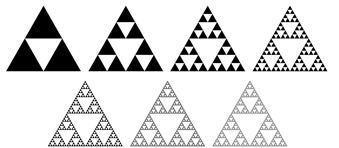
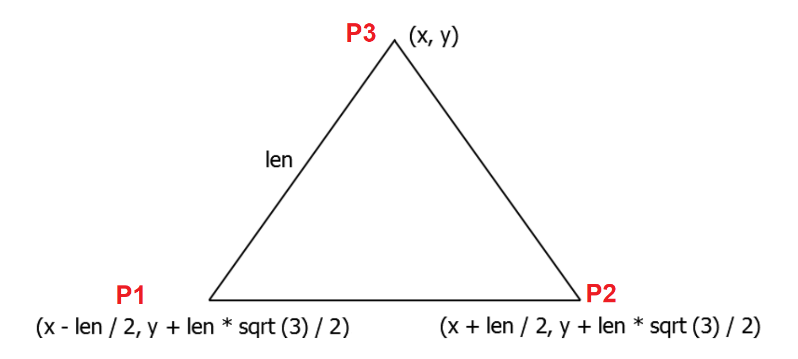
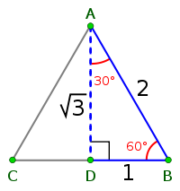
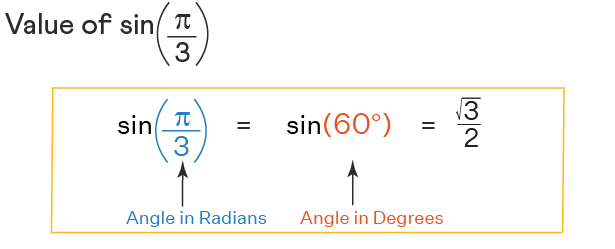
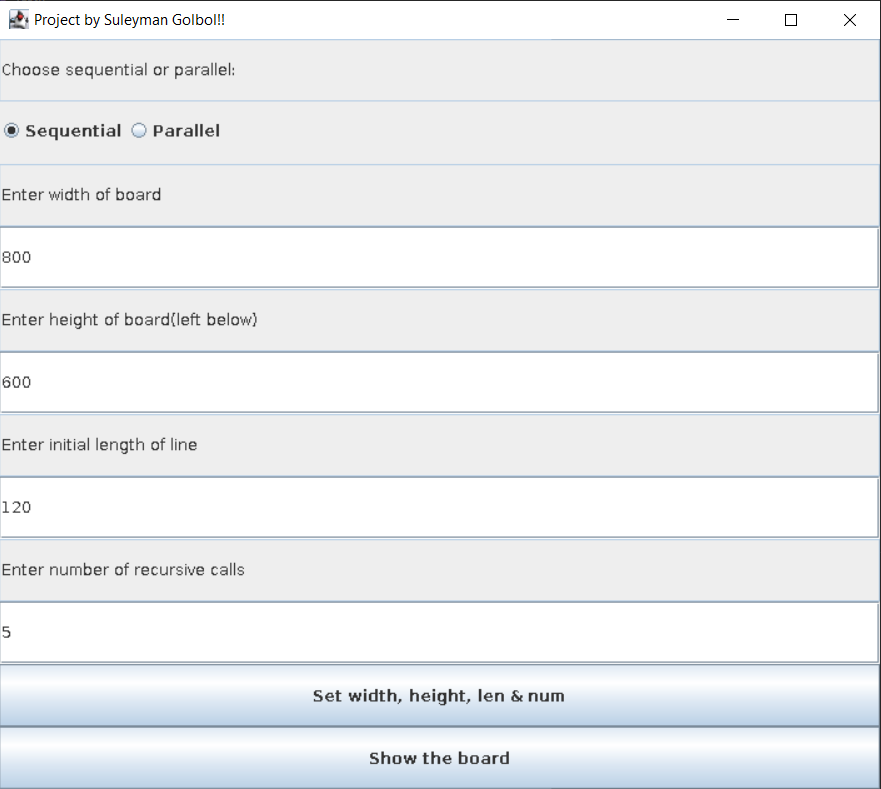
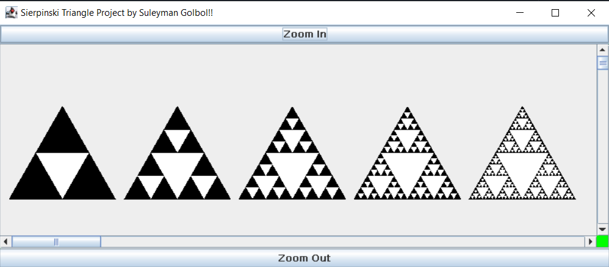
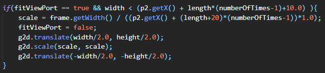
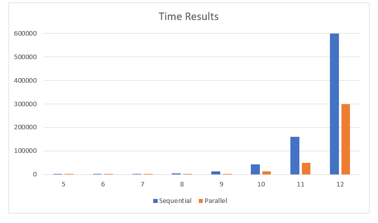
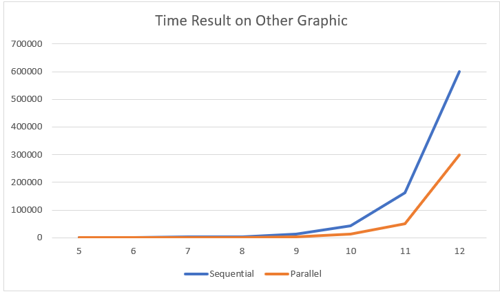
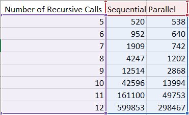

# Sierpinski-Triangle
Sierpiński Triangle with Sequential and Parallel Processing

# Sierpinski Triangle ́

## Süleyman Gölbol

#### UP Famnit

## 76210123@student.upr.si

## ABSTRACT

This paper provides a extended report about Programming
III Project Sierpi ́nski Triangle. Project has 2 parts which is
Sequential and Parallel.

The project also measures run-time needed to complete. It
computes for the both parts. Also, the application has some
functions to Zoom In, Zoom Out and Moving the viewport
with scrollbar.

## Keywords

Recursion, triangle, Sierpinski

## 1. INTRODUCTION

The Sierpi ́nski triangle is a fractal set with the all equilateral
triangle shapes, recursively subdivided into smaller equilat-
eral triangles. History of it goes until 1915 which Wac law
Sierpi ́nski described the Sierpinski triangle.

To draw these fractals, we start with a full equilateral tri-
angle which is fully painted black. Then we compute the
middle of each line, and we draw another triangle inside
which is painted white.

In each step, we do this for every black triangle that is inside
of big black triangle. To achive these, recursion is used. You
can see an example of Sierpi ́nski Triangle.



```
Image: Image of Sierpi ́nski triangle
```

In each step of recursion, the length of one line of white
triangle is equal to the half of the black triangle. This makes
the triangle proper shaped. The application asks for length
of the line length and it asks for how many recursive calls
do you want for triangle. Also, you can change the size of
width and height of the board area. After answering these
questions, you click on the ”Show board” button and board
comes to the screen.

## 2. DESIGN

## 2.1 Equilateral TriangleDesign


To design the triangle structure as equilateral triangle first
I needed to find a formula for this. So I used the formula
below.



Drawing of Sierpi ́nski triangle edge coordinates

sqrt(3)/2 is also can be showed as

##### √3/2

Now let’s draw a equilateral triangle and show it on triangle.




sin(PI/3) is equal to

##### √3/2

so in the java code instead of
sqrt(3)/2, I used sin(PI/3).

## 2.2 GUIDesign

For designing of GUI; I created 2 classes that are extended
from JFrame.
They are called ’Test’ and ’Board’.

### 2.2.1 Test Class

Test class contains main(String args[]) method. So my ap-
plication will start from Test class.


Main page consists of several components.
I used GridLayout so normally it doesn’t let different but-
tons or components to be in the same line. But me, to put
both radio buttons in the same line/row, I used a tactique.

First, I created a radio button panel. Then I created a
BoxLayout. Then I set the layout of this panel as BoxLay-
out with X axis orientation. Then I added radio buttons
to the panel. And finally I added radio button panel to my
main panel. This way, radio buttons could be able to in the
same line.

Other components from main page are width and height
text fields. As requested in the Implementation guidelines,
the default size of the window is 800x600px but can be ad-
justed manually by entering new values.

Another component is text field for length of line. I wanted
the application to be used for many lengths so I added this
option.

Other text field component is recursive call numbers. User
can adjust the number of recursive calls in the application
if he/she wants.

Lastly, in main page there are 2 buttons;
first button sets all the text field areas to the variables. The
other button ”Show the Board” opens the board page with
settings in main page.

### 2.2.2 Board Class


My board class consists of several parts.
My application initially scales to fit all points in the view-
port as requested in the pdf requirements.

The first part in Board Frame is Zoom buttons. There are
2 buttons; on the top and on the bottom. Zoom In button
helps user to zoom in.

I created a private double called scale and set it to 1.0. Then
I created width and height variables that will get the current
width and height of the frame. When user clicks to Zoom In
button, scale will be scaled by 1.1 (and if user clicks Zoom
Out button scale will be divided by 1.1. Then repaint()
method is called. Repaint uses paintComponent.
scale will be used Graphics2D class’ scale method and width/height
will be used Graphics2D’s translate method. This way my
scale works.

Another component that I put is Scrollable Pane. I added
ScrollPane to the frame. Then I set scrollPane’s setView-
portView to the boardPanel. But this was not enough.



To confirm the requirement of initially it should be scaled to
the screen, I used scale again. First I got the current width,
then I multiplied number of triangles with length of triangle
[and I added the interval length between triangles too which
is 20]. So this way, I made sure about it scales to screen.
Also I set the fitViewPort boolean variable to false for not
to automatically fit view port again.

### 2.2.3 Triangles


In the first section of Design part, I already mentioned about
Equilateral Triangle. Now I am going to mention about Sier-
pinski Triangle.


In the Board class, I got the recursive call times from Main-
Page textfield area. Then I draw black triangles as much as
recursive call numbers.


To draw other lines inside and filling them white was the
difficult part.
I created a class called Triangle. But to store all the points, I
needed a data sturcture. Normal ArrayList was not enough
for me because I needed to store triangle point values to I
created a data structure class which is basically same with
ArrayList but also a new add() method was added so it was
just extended.

In the Pdf requirements the task was ”The processes should
compute the position and the distance of all lines that form
a fractal and insert them in a data structure. When the al-
gorithm reaches a maximum number of recursive calls, the
main process draws all lines in the data structure to obtain
a visual representation of the fractal.”. So first, I needed to
compute all recursive positions.
In Triangle class, initially I already sent the initial Point po-
sitions. So for each big triangle, I just added (length+10) for
new big triangle positions. The deal was inside of triangles.

I created a method called ”recursivePointAdder”, This method
has an parameter for recursive number count. So in each
step of recursive call I just decremented it by 1, and when
it reaches 0 I stopped my execution of triangle drawer.
recursivePointAdder method first created temporary point
variables to keep big triangle points. Then finds the middle
point between p1 and p2; p2 and p3; and p1 and p3 and
these are the new points of big white triangle inside.
Then these points are added to data structure [which will
be used at the end].
Then these process keeps continue for above white triangle,
left below of white triangle and right below of white triangle
recursively.

At the end, drawLine() method is called and triangles are
drawed with the help of java.awt.geom.Path2D class also
with points stored in data structure.

## 3. THE PROCESSOR

The Processors are actually really important for the work
that continues. My application consists of 2 parts; sequen-
tial and parallel.
For the sequential part, I handled everything inside of a for
loop sequentially and that was it. But for a faster applica-
tion, I needed to use parallel programming.
Multithread is really important for parallel programming.
So I needed to split the work into some parts to use the help
of parallel programming.
So, I decided to create a Runnable class that implements
Runnable to use run() method. Because when an object
implementing interface Runnable is used to create a thread,
starting the thread causes the object’s run method to be
called in that separately executing thread as it says in doc-
umentation. So that was the main reason that I used it.
I created an array with my Runnable class[which is called
’DrawRunnable’]. The size of it was the thread number and
I decided to make thread number 1000. Then I created an
other Thread array with the same size. In each for loop, I
put the runnable target inside of thread and then I started
the thread.
After the loop ends, I joined all of the threads inside of a
try catch block to make sure about InterruptedException.


Each time after threads[ith number] starts, run method is
used. So in my run method I stored the points that’s on ar-
rayList. Then I added this points into an double array so I
can understand and use them easily with the help of Path2D
class’ moveTo and lineTo methods. After using lineTo(s), I
closed the path with path.closePath() method.


After every thread was runned all I needed to was fill the
triangles with white color. The lines are already drawed. In
the DrawRunnable class, I also created a local variable path
that will keep every path. So, at the end to draw; I filled
with getPath() argument. [ g2d.fill( tasks[i].getPath() ); ]

## 4. TECHNICAL REMARKS


When there is insufficient space to allocate an object in the
Java heap, the garbage collector cannot make space avail-
able to keep a new object, and the heap cannot be expanded
further. So in this situation ”java.lang.OutOfMemoryError
: java Heap space” comes.

To solve this; I used ”-Xmx2048m” command. Also I added
this parameter to my makefile so if someone else uses or
tests my application later he/she can use my makefile with
-Xmx2048m command. This command increases the heap
size, 2048m shows 2 GB so my application is up to 2048 Mb
heap memory usage.

## 5. RESULTS


After all, I tested every case 3 times and for each configura-
tion, I ran it three times. Then I summed them and divided
them by 3 so the average running time came as the final
result.



In the graphic above, the numbers on the left shows the
running time with milliseconds. Blue color shows sequential
part and orange color shows parallel part. And numbers be-
low shows recursive calls.



I believe that one graphic is not enough to understand ex-
actly so I also created a line chart to see better with different
point of views.


The table above shows the exact running time results on
a table.
As you can see in the beginning the sequential results were
faster but when the things get heavy, parallel result started
to become much more faster.

## 6. CONCLUSIONS

As can be seen from the results, my project application is
a good example of to get the difference between sequential
and parallel computing. It uses both of them.
To sum up, the presented graphics is also appropriate for
showing results for users to understand.


